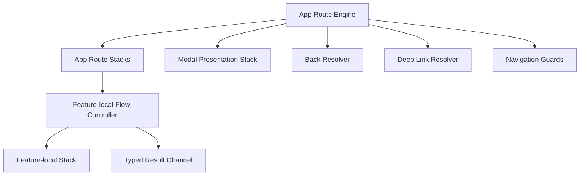
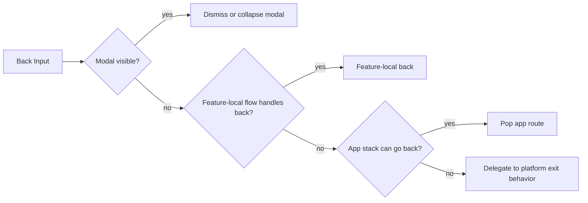

# Navigation Workstream

This document turns navigation from a vague architectural preference into an implementation program another agent can pick up without reconstructing the design from chat history.

## Outcome

Create a navigation foundation for a complex multimodular app that:

- keeps feature modules isolated
- makes back behavior first-class on Android and iOS
- models modals explicitly instead of treating them as ordinary screens
- allows feature-local flows to own their own internal navigation
- keeps deep links, restoration, and external entry safe and typed
- stays compatible with the shared UDF/store direction

## Core Decision

Use a layered navigation model rather than one flat stack.

Layers:

1. app-level route stacks for top-level product destinations
2. modal presentation stack for dialogs, sheets, and full-screen overlays
3. feature-local flow stacks for multi-step flows owned by one feature
4. typed result channels for parent-child flow handoff
5. platform back dispatchers that resolve back behavior through explicit policy rather than implicit `pop()`

The navigation engine belongs to the app boundary.
Feature modules own route contracts, local flow contracts, and navigation intents/effects.
Feature modules do not own the app back stack.

Concrete contract families to standardize:

- `AppRoute`: app-global destinations and root-stack members
- `ModalRoute`: route-bearing modals and overlays owned by app-level presentation
- `FeatureFlowRoute`: feature-local flow destinations not visible outside the feature
- `FeatureResult`: typed child-flow completion values
- `NavigationRequest`: typed navigation intent emitted outward from feature code

Feature-level export contract:

- one typed entry surface per navigable feature
- public route contracts for app-global entry into the feature
- outward navigation and result contract types
- deep-link parsing input or route-mapping input owned by that feature

Cross-feature ownership rule:

- feature code may emit only app-owned typed route contracts or app-owned `NavigationRequest` values
- feature code may not emit another feature's implementation-local routes

Root-stack model for v1:

- one root app stack with future-ready root section identifiers
- multiple root stacks are deferred until tabs or true root sections justify them

Route payload constraints:

- IDs and stable arguments only
- no full mutable models
- no platform objects
- no callbacks or lambdas
- persisted or external-entry route payloads require version-tolerant decoding

Feature-local flow persistence ownership:

- feature-local flow state is feature-owned while active
- once mounted into app navigation, restoration policy is app-owned
- pending feature-local flow state is restorable only if the route payloads and required result linkage are explicitly serializable

## Non-Negotiable Rules

1. Screens, modals, overlays, and feature-local flows are different presentation types and must not be collapsed into one undifferentiated stack.
2. Back presses are navigation input, not UI accidents.
3. Every route that can survive process death must be serializable and version-tolerant.
4. Deep links are untrusted input and must pass through a typed resolver.
5. Feature modules may own internal flow stacks, but only the app boundary may arbitrate app-global navigation.
6. Navigation results must be typed.
7. Multi-back-stack behavior is allowed only for real root sections such as tabs.
8. Predictive back on Android and swipe-back on iOS must be designed into the model, not added later.
9. Guards such as auth, unsaved changes, and feature flags must have a formal interception point.
10. Navigation state, modal state, and restoration state must be testable without UI runtime.

## Reference Model

Back resolution is a pipeline:

## Problem Breakdown

### 1. Route ownership

The app needs typed app-global routes.
Each feature needs typed feature-local routes.
Neither should depend on the other feature's implementation.

### 1a. Modal taxonomy

Modal presentation types for v1:

| Type | Route-bearing | Stackable | Default dismissable | Typical owner |
| --- | --- | --- | --- | --- |
| `Dialog` | no | no | yes | app or feature |
| `Sheet` | sometimes | no | yes | app |
| `FullscreenModal` | yes | no | depends on route policy | app |
| `Overlay` | no | no | usually yes | app |

Notes:

- route-bearing modals must use `ModalRoute`
- transient confirmations should not be restored by default
- modal ownership is app-level even when the content belongs to one feature

### 2. Presentation ownership

Modal behavior is not ordinary screen behavior.
Dialogs, sheets, and full-screen modals need separate policy for:

- back dismissal
- gesture dismissal
- result handoff
- restoration
- z-order and exclusivity

### 3. Back policy

Back needs explicit precedence:

1. active modal
2. active feature-local flow
3. current app stack
4. platform exit

### 4. Result model

Feature-local flows need structured completion:

- completed with value
- cancelled
- dismissed by back
- interrupted by guard or deep link

### 5. Deep links and restoration

Deep links and restored state must resolve into the same typed route model.
Do not create one path for links and another for in-app navigation.

### 6. Guards and interception

Navigation needs a guard layer for:

- auth required
- unsaved changes
- unavailable feature/module
- invalid restored state
- invalid deep-link input

### 7. Multi-stack rules

If the app later adds root tabs or sections, each root may have its own stack.
Without explicit policy, tab reselect and “return to previous place” behavior becomes inconsistent.

## 4-Step Delivery Cycle

### Step 1: Navigation Domain And Ownership

Goal:
define the route model, presentation taxonomy, and ownership boundaries

What must be decided:

- app-global route types
- modal presentation types
- feature-local flow contract shape
- route serialization requirements
- app module versus feature module ownership

Highlights:

- typed route contracts
- explicit distinction between app stack and modal stack
- feature-local navigation treated as part of feature flow, not app-global routing
- concrete contract vocabulary is locked before implementation

Things to overcome:

- avoiding one giant central graph with concrete feature imports
- avoiding hidden cross-feature dependencies
- preventing route argument drift

Done when:

- route taxonomy is final
- ownership boundaries are final
- serialization requirements are listed
- modal taxonomy is listed with ownership and stackability rules
- feature export contract is explicit
- v1 root-stack identity model is explicit

### Step 2: Back, Modal, And Result Semantics

Goal:
make back behavior, modal behavior, and result passing first-class

What must be decided:

- back resolution priority
- predictive back and swipe-back expectations
- modal dismissal policy
- feature-local flow completion model
- interruption and cancellation semantics
- back ownership and gesture veto policy
- stacked-modal and modal-replacement rules
- feature-local flow identity and re-entry rules

Back resolver ownership:

- one back resolver owned by the app route engine is the single authority
- modal host and feature-local flow handlers return `Consumed` or `NotHandled`
- lower layers do not mutate the app stack directly in response to back

Result lifecycle:

- `Success(value)`
- `Cancelled`
- `DismissedByBack`
- `Interrupted`
- `Invalidated`

Gesture policy:

- every presentation type declares whether gesture-back is `Allowed`, `Blocked`, or `ConditionallyBlocked`
- conditional blocking must be tied to explicit state such as unsaved changes or active confirmation requirements

Modal stack rules:

- one active route-bearing modal at a time in v1
- transient dialog over sheet is allowed only when explicitly declared by the parent presentation policy
- modal replacement must specify whether prior modal state is destroyed or suspended

Dismissability:

- every modal must declare `dismissable` explicitly
- blocked back on non-dismissable modal must surface intentional UX feedback rather than silently no-op

Feature-local flow identity:

- every active feature-local flow must have a stable flow instance key
- back only applies to the active flow instance
- parent re-entry must define whether the same flow instance is resumed or a new instance is started

Highlights:

- back is modeled as input into a resolver
- results are typed and explicit
- modal behavior is modeled separately from screen navigation
- gesture-back policy is explicit, not implied
- interruption semantics are closed and testable

Things to overcome:

- mixing modal dismissal with ordinary stack pops
- losing results on back or process death
- inconsistent Android versus iOS back semantics

Done when:

- back precedence is explicit
- modal stack rules are explicit
- result contracts are explicit
- resolver ownership is explicit
- gesture policy is explicit
- feature-local flow instance rules are explicit

### Step 3: Deep Links, Restoration, And Guards

Goal:
make external entry, restored entry, and guarded transitions converge on one safe model

What must be decided:

- deep-link registry and parser boundary
- invalid input fallback behavior
- restoration rules for stacks, modals, and feature-local flows
- guard and interception API
- auth and unsaved-changes interception behavior
- precedence between fresh external entry and restored state
- boot-time resolution timing
- observability for rejected or rewritten navigation
- route payload versioning and migration policy

Resolution precedence for cold start:

1. fresh notification tap or app link
2. fresh app deep link
3. valid saved app stack and modal state
4. canonical safe root

If a fresh external entry exists, saved navigation state is discarded unless the resolved policy explicitly supports merge for that route family.

Guard pipeline:

`parse -> validate -> derive restoration candidate -> run guards -> commit route`

Guard rules:

- a route may be redirected at most once per resolution pass
- redirect loops must be detected and dropped to safe-root behavior
- guard continuation is not restorable unless explicitly modeled and serialized

Restoration scope:

- `app route stack`: restorable
- `modal stack`: per modal-type policy
- `feature-local stack`: restorable only for declared flow types
- `pending result request`: not restorable by default
- `guard continuation`: not restorable by default

Modal restoration policy classes:

- `Restorable`
- `ConditionallyRestorable`
- `NeverRestorable`

Invalid-input fallback categories:

- reject to safe root
- rewrite to nearest valid parent route
- show recoverable error
- log structured diagnostics

Versioning policy:

- externally entered or persisted route payloads must support backward-compatible decode or explicit versioned migration
- decode failure falls back to safe-root behavior and logs diagnostics

Boot-time contract:

- route resolution does not begin until the app route engine and guard registry are ready
- external entries received before readiness are queued

Safe-root contract:

- unauthenticated safe root: app landing or auth entry route
- authenticated safe root: primary home route

Observability:

- log parse failure
- log validation failure
- log guard redirect
- log restoration drop
- log fallback route selection

Highlights:

- one typed entry pipeline for in-app, deep-link, and restored navigation
- untrusted input validation
- explicit restoration policy instead of best-effort guesswork
- explicit precedence between restored and fresh external entry
- explicit fallback and diagnostic rules

Things to overcome:

- restored route payloads that no longer deserialize cleanly
- interrupted flows after auth or permissions
- double navigation from duplicate inputs

Done when:

- deep-link resolution policy is final
- restoration policy is final
- guard/interceptor model is final
- precedence table is final
- safe-root behavior is final
- observability requirements are final

### Step 4: Migration, Validation, And First Feature Cut

Goal:
turn the navigation model into an executable implementation plan with safe cut lines

What must be decided:

- first implementation modules
- host wiring boundaries
- validation matrix
- migration order for the first feature slice
- anti-regression test strategy
- coexistence rules between legacy and new navigation during rollout
- rollback strategy and cut line

Concrete first migration cut:

- app root host boundary
- one read-only feature route subtree
- one dismissable modal type
- no external-entry pilot in the first cut

Pilot subtree for planning baseline:

- `app root -> tasks list -> task details`
- one dismissable confirmation dialog or sheet owned by the same subtree

Mixed-model coexistence invariant:

- one host owns one subtree
- legacy and new navigation may coexist only across an explicit adapter boundary
- mixed ownership inside the same route branch is forbidden

Rollback strategy:

- the first migrated subtree must sit behind a host-level cut line or strangler toggle
- rollback must not require rewriting the rest of the app navigation model

Validation matrix by layer:

- shared unit tests for route serialization and reducer behavior
- coordinator tests for back, modal, and result policies
- Android integration tests for deep links, process death, predictive back, and modal restoration
- iOS host tests for swipe-back expectations and restoration behavior

Mandatory failure-mode cases:

- process death with restored modal or child flow
- predictive back during modal dismissal
- deep link hitting a guarded route
- duplicate navigation intents or race conditions
- result delivery after back or cancel
- invalid restored payload fallback

Readiness gate before implementation starts:

- pilot subtree named
- legacy/new boundary named
- rollback path named
- validation cases enumerated
- owning module scopes named

Highlights:

- root coordinator or route engine owned by app boundary
- first feature-local flow chosen intentionally
- navigation tests defined before broad rollout
- coexistence and rollback are designed in before migration starts

Things to overcome:

- mixing old and new navigation models during migration
- keeping deep-link behavior stable during refactor
- preserving back behavior during rollout

Done when:

- implementation order is final
- first migration slice is final
- validation matrix is final
- rollback path is explicit
- legacy/new coexistence rules are explicit
- readiness checklist is complete

## Ticket Slice

### NAV-001: Lock navigation domain model and ownership boundaries

- Status: Ready
- Owner: Unassigned
- Write scope: this file, [backlog.md](/Users/maksymmoroz/startup/kolo/docs/planning/backlog.md), and [starter-architecture.md](/Users/maksymmoroz/startup/kolo/docs/planning/starter-architecture.md)
- Dependencies: FND-003
- Goal: prevent app-global, modal, and feature-local navigation from collapsing into one vague stack
- Rich description:
  - define typed app routes, modal presentation types, and feature-local flow contracts
  - define what belongs to app boundary versus feature boundary
  - define what must be serializable for restoration
- Done when:
  - route taxonomy is named
  - ownership boundaries are explicit
  - serialization expectations are explicit

### NAV-002: Lock back, modal, and result semantics

- Status: Ready
- Owner: Unassigned
- Write scope: this file, [backlog.md](/Users/maksymmoroz/startup/kolo/docs/planning/backlog.md), and [starter-architecture.md](/Users/maksymmoroz/startup/kolo/docs/planning/starter-architecture.md)
- Dependencies: NAV-001
- Goal: make back handling and modal behavior intentional before feature flows spread
- Rich description:
  - define back precedence across modal, feature-local, and app stacks
  - define predictive back and iOS swipe-back expectations
  - define typed result handoff for child flows
- Done when:
  - back resolver policy is explicit
  - modal dismissal policy is explicit
  - result model is explicit

### NAV-003: Lock deep-link, restoration, and guard model

- Status: Ready
- Owner: Unassigned
- Write scope: this file and [backlog.md](/Users/maksymmoroz/startup/kolo/docs/planning/backlog.md)
- Dependencies: NAV-001, NAV-002
- Goal: unify external entry, restored entry, and guarded transitions under one typed navigation model
- Rich description:
  - define deep-link registry and parser boundary
  - define restoration behavior for app stacks, modals, and feature-local flows
  - define interception for auth, unsaved changes, and invalid payloads
- Done when:
  - deep-link policy is explicit
  - restoration rules are explicit
  - guard model is explicit

### NAV-004: Define migration path, validation matrix, and first implementation cut

- Status: Ready
- Owner: Unassigned
- Write scope: this file and [backlog.md](/Users/maksymmoroz/startup/kolo/docs/planning/backlog.md)
- Dependencies: NAV-001, NAV-002, NAV-003
- Goal: turn the navigation design into a safe rollout plan instead of a one-shot rewrite
- Rich description:
  - define the root route engine boundary and first host integration point
  - define first feature slice to migrate
  - define reducer, coordinator, deep-link, back, modal, and restoration validation expectations
- Done when:
  - rollout order is explicit
  - first feature cut is explicit
  - validation matrix is explicit

## Risks To Keep Visible

- a flat route model will break on modals, multi-stack tabs, and feature-local flows
- app-global navigation can leak into feature code if contracts are not kept narrow
- restoration bugs will become release blockers if route serialization is vague
- back behavior will drift if Android and iOS expectations are not modeled early
- deep-link handling will rot if it is separate from ordinary route construction

## Deferred Questions

- does the MVP need multiple root stacks immediately, or only one root stack with future-ready contracts?
- should modal presentation state be fully serializable, or only restorable for selected modal types?
- should results be modeled as reducer actions, coordinator callbacks, or both?
- should guards run synchronously from typed route validation, asynchronously from middleware, or as a layered combination?
